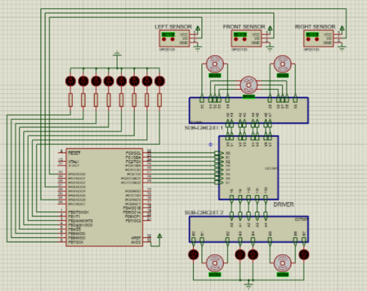
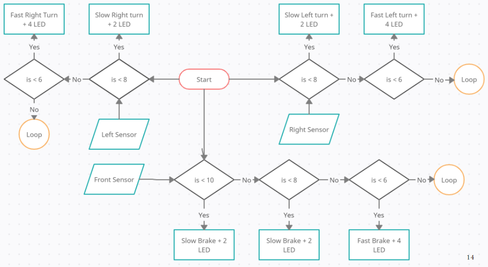

# ATMEGA32 for Obstacle Detection and DC Motor Retardation :traffic_light::oncoming_automobile:  

## Overview
This is a college course project that endeavors to leverage the computational capabilities of the ATMEGA32 chip to develop a 
sophisticated system, in conjunction with sensors, to ensure the utmost safety of passengers. Through the utilization of LED 
string lines, we aim to provide accurate indications of the proximity of objects to the vehicle from the LEFT, RIGHT, and FRONT 
directions. In the event of an absence of response, the ATMEGA32 chip assumes control and adeptly directs the car by implementing 
precise adjustments in its course and applying appropriate braking measures to guarantee optimal outcomes.  

## Proteus Circuit Configuration
  

## System Flowchart
  

### Functionality of the Left & Right Proximity Sensors (GP2D120)
- At 8 units distance, 2 LEDs light up.
- At 6 units distance, 2 LEDs light up, and the car takes a 45-degree clockwise/anticlockwise turn if the driver does not respond.
- At 4 units distance, 4 LEDs light up, and the car takes a 90-degree clockwise/anticlockwise turn until the driver responds.

### Functionality of the Front Proximity Sensor (GP2D120)
- At 10 units distance, 2 LEDs light up, and the car slowly brakes ensuring a pseudo-constant speed given that the driver does not respond.
- At 8 units distance, 4 LEDs light up, and the car slowly brakes ensuring a pseudo-constant speed given that the driver does not respond.
- At 6 units to 4 units distance, 4 LEDs light up, and the car brakes to a halt until the driver responds.  

## Requirements
To run the ATMEGA32 for Obstacle Detection and DC Motor Retardation project, you will need the following:

1. ATMEGA32 chip;
2. GP2D120 (proximity sensor)
3. L293D DC Motor Driver
4. ULN2003A Stepper Motor Driver
5. DC Motor
6. Stepper Motor
7. LED (Red, Green, Yellow)
8. Wire
9. Power Supply and Ground
10. Proteus 8 Professional (S.W)
11. Code Vision AVR (S.W)

